# 一、C++11多线程快速入门

## (一) 多线程概述

>❓为什么要用多线程？
>
>- 任务分解 : 耗时的操作 , 任务分解 , 实时响应
>- 数据分解 : 充分利用多核CPU处理数据
>- 数据流分解 : 读写分离 , 解耦合设计

## (二) 第一个多线程

>[101first_thread.cpp参考代码](https://github.com/WONGZEONJYU/stu_cpp_thread/blob/main/101first_thread.cpp)
>
>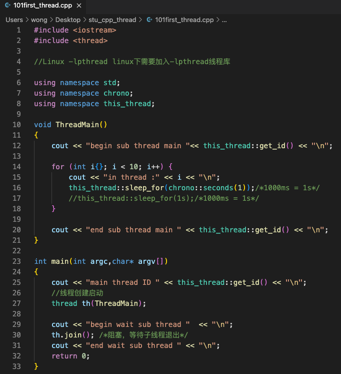
>
>

## (三) `std::thread` 对象生命周期和线程等待和分离

>[102thread_detach.cpp参考代码](https://github.com/WONGZEONJYU/stu_cpp_thread/blob/main/102thread_detach/102thread_detach.cpp)

### 1.实验 : thread对象被销毁 , 程序崩溃

>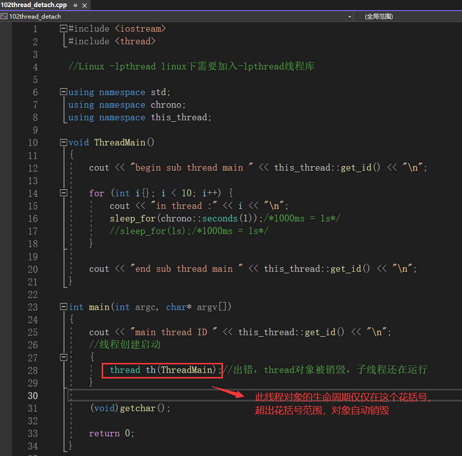
>
>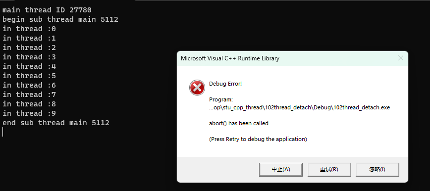
>
>```tex
>📖上面的问题可以通过 线程分离(detach()) 或者 等待线程结束(join()) 去解决,不过这两种解决方案都会存在一定的问题!往下走有更好的解决办法
>```
>
>

### 2.实验:子线程与主线程分离

#### (1) detach实验

>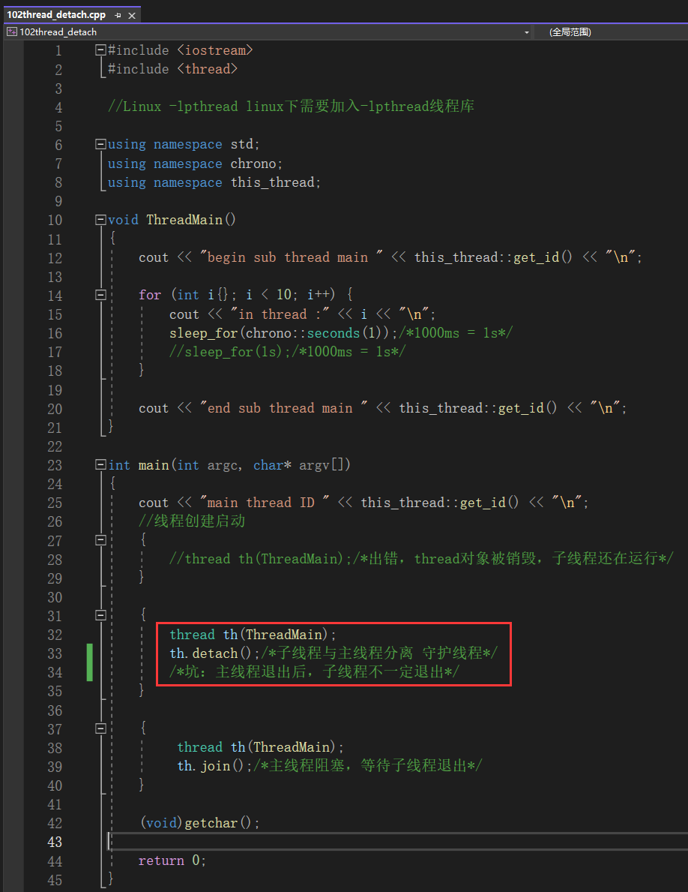
>
>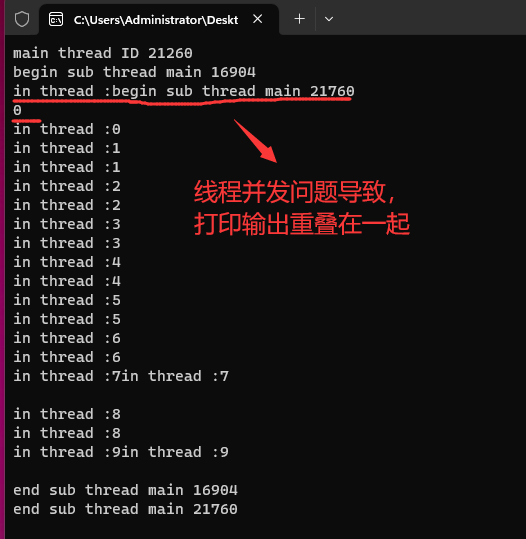
>
>```tex
>📖结果显示,子线程被分离了,与主线程没有任何关系了,也不需通过join()去等待线程的结束。
>❓但是此刻会带来一个问题:
>‼️ ‼️ ‼️ 假如主线程已经退出,主线程退出带来主进程退出,但是子线程还在运行,这个时候,静态局部变量、全局变量、堆空间、共享内存等资源都已经被操作系统回收,如果子线程访问了这些资源,就会导致程序的崩溃,这是一个值得注意的问题。
>```

#### (2) 利用全局变量通知线程退出

>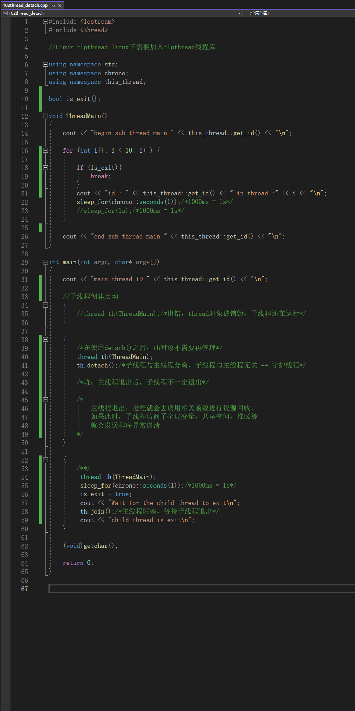
>
>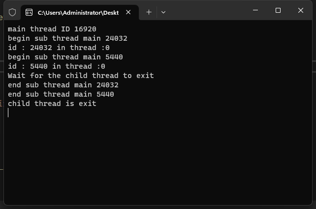

## (四) 全局函数作为线程入口分析参数传递内存操作

### 1. 问题一 : ❓如何传递参数?

>- 对所有的参数都做复制
>
>[103thread_para.cpp参考代码](https://github.com/WONGZEONJYU/stu_cpp_thread/blob/main/103thread_para/103thread_para.cpp)
>
>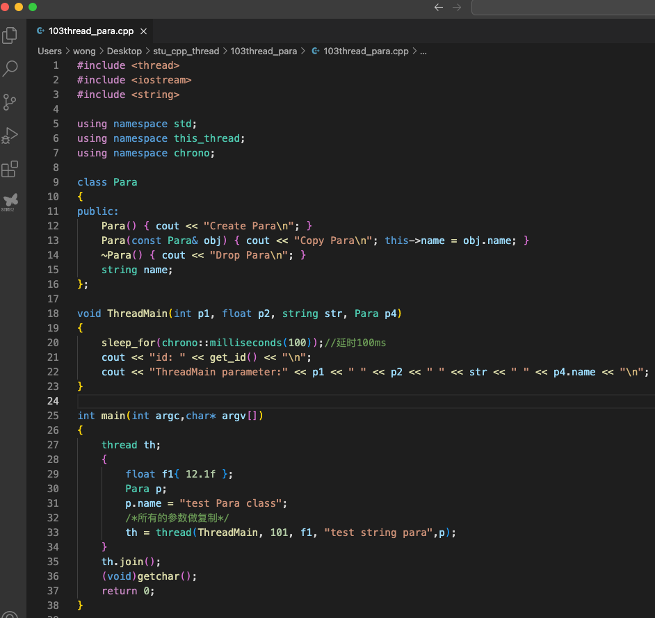
>
>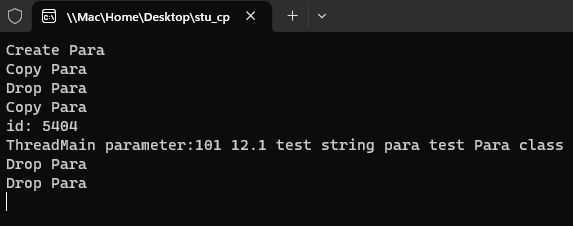

### 2. 问题二 : ❓如果参数是指针或引用 , 会有哪些问题的存在 ? 需要考虑什么问题?

>如果传入的是指针或者引用 , 有可能会造成访问非法内存 , 访问空指针等情况 , 这是一个很重要的问题 !
>
>如果被 引用 或者被 指向 的资源已经回收了 , 子线程还没结束 , 访问了非法内存就造成程序崩溃 !
>
>又或者资源被别的线程正在使用 , 引发了资源竞争问题 , 导致数据混乱 ! 

## (五) 线程函数专递指针和引用

### 1. 参数传递的一些坑

>- 传递空间已经销毁
>- 多线程共享访问一块空间
>- 传递的指针变量的生命周期小于线程生命周期

### 2. 传递指针

>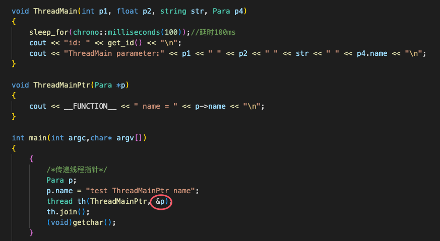
>
>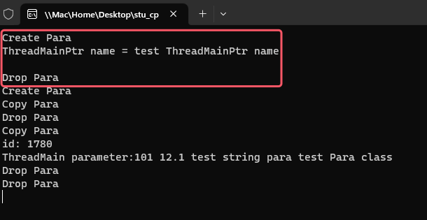
>
>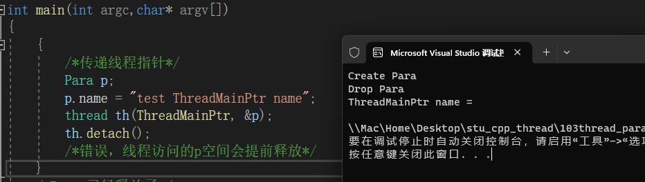
>
>避免办法 (不是唯一 , 也一定是最好) : 
>
>- 做成静态局部变量或全部变量
>- 传递堆空间
>- 把线程对象和访问的变量放在一个类下面 , 让其生命周期相同
>- 上锁

### 3.传递引用

>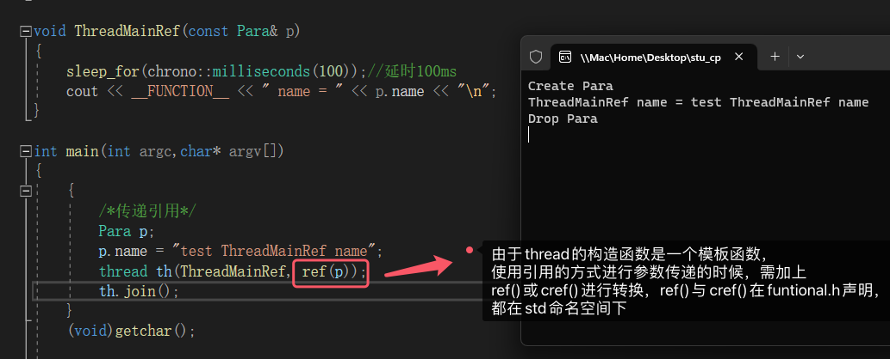
>
>```
>📖传递引用与传递指针都会遇到相同的问题,解决办法参考指针的解决办法
>```

## (六) 类成员函数作为线程入口函数

>[104thread_class参考代码](https://github.com/WONGZEONJYU/stu_cpp_thread/tree/main/104thread_class)

### 1. 实验一 : 类成员函数作为线程入口函数

>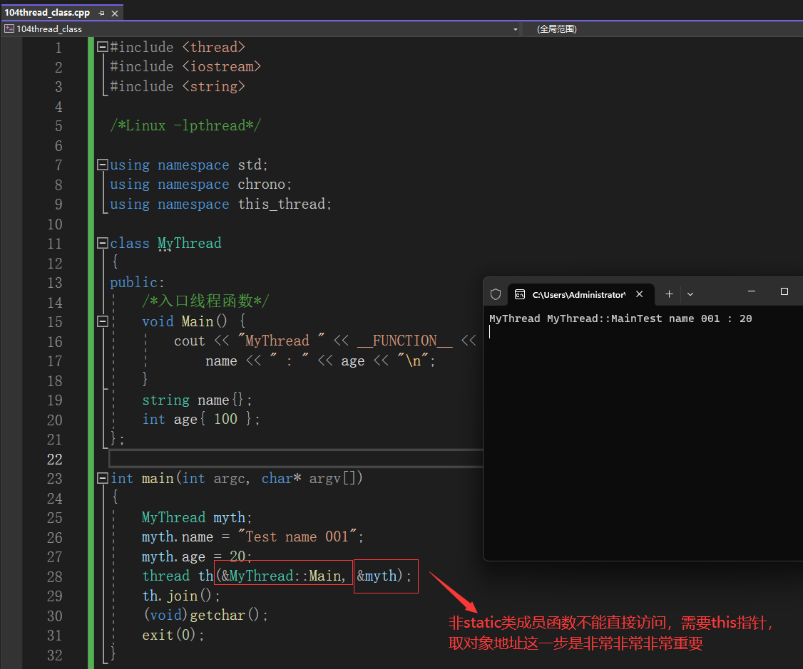

### 2. 实验二 : 简单封装一个线程类

>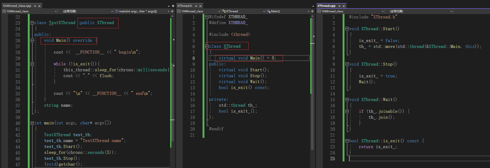
>
>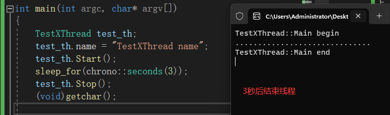

## (七) `lambda` 表达式临时函数作为线程入口函数

>[实验参考代码链接](https://github.com/WONGZEONJYU/stu_cpp_thread/tree/main/105thread_lambda)
>
>lambda函数的基本格式 : [ "capture list " ] ( "parameter" ) mutable -> "return value" { "...code" }
>
>```c++
>auto f { []()mutable->int {} };  /*返回值int，不捕获任何变量，参数列表为空，可修改和拷贝任何变量*/
>
>auto f { []()mutable {} }; /*默认为返回值默认为void*/
>
>auto f { [](){} };
>/*默认为返回值默认为void,参数列表空，不捕获和不修改任何变量（注意是能修改拷贝，而不是值本身）*/
>
>auto f { []{} };
>/*默认为返回值默认为void,参数列表空，不捕获和不修改任何变量（注意是能修改拷贝，而不是值本身）*/
>
>/*详细请参考https://en.cppreference.com/w/Main_Page*/
>```

### 1.实验一 : 全局 `lambda` 表达式作为线程入口函数

>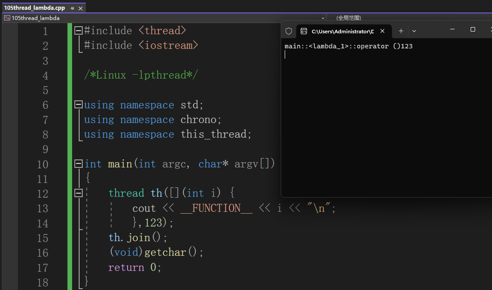

### 2. 实验二 : 线程入口函数为类成员 `lambda` 表达式

>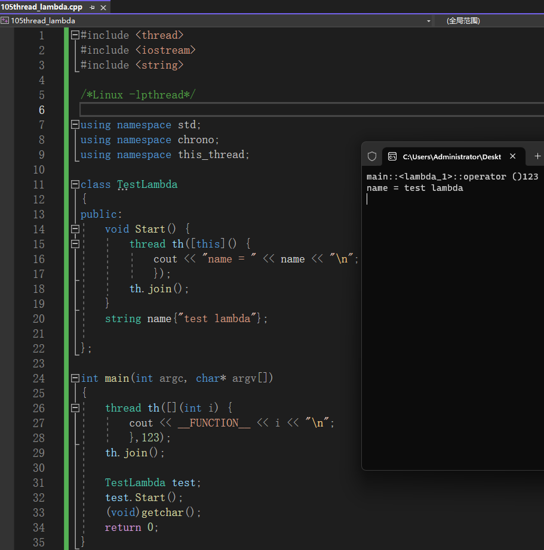

## (八) call_once多线程调用函数 , 但函数只进入一次 (补充知识)

>[105_2_thread_callon实验参考代码](https://github.com/WONGZEONJYU/stu_cpp_thread/tree/main/105_2thread_callone)
>
>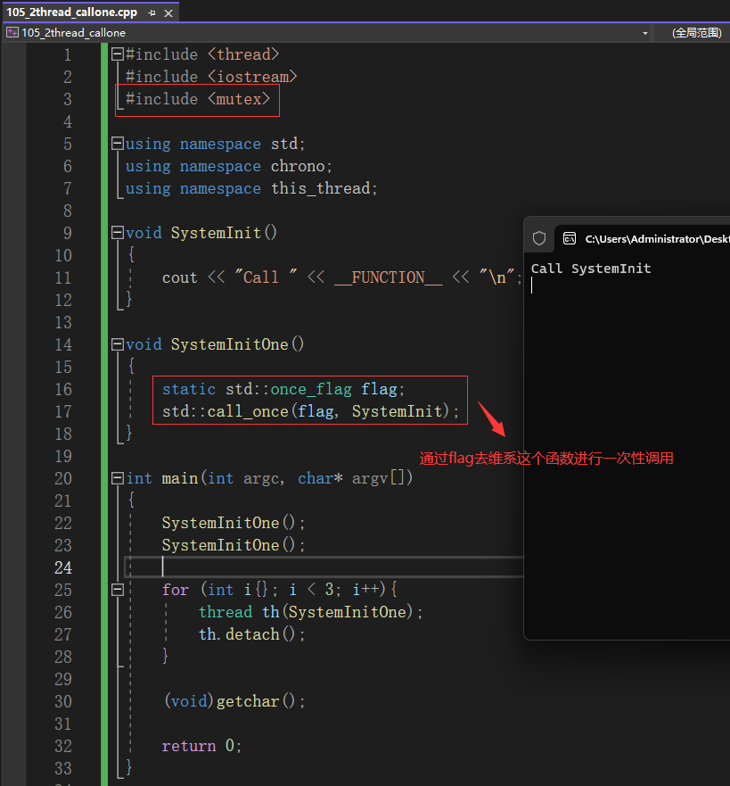

