# 三、C++17多核并行计算

## (一)手动实现多核base16编码

### 1. C++11实现base16单线程编码

>- 二进制转换为字符串
>- 一个字节8位拆分为两个4位字节（最大值16）
>- 拆分后的字节映射到 `0123456789abcdef`
>
>```c++
>static const char base16[] = "0123456789abcdef";
>void Base16Encode(const unsigned char *data,int size,unsigned char *out)
>{
> for (int i = 0; i < size; i++)
>	{
>		unsigned char d = data[i];
>		char a = base16[(d >> 4)];
>		char b = base16[(d & 0x0F)];
>		out[i*2] = a;
>		out[i * 2+1] = b;
>	}
>}
>```
>
>[手动实现base16编码(单线程)参考代码](https://github.com/WONGZEONJYU/stu_cpp_thread/blob/main/115base_16_thread_c%2B%2B11/115base_16_thread_c%2B%2B11.cpp)
>
>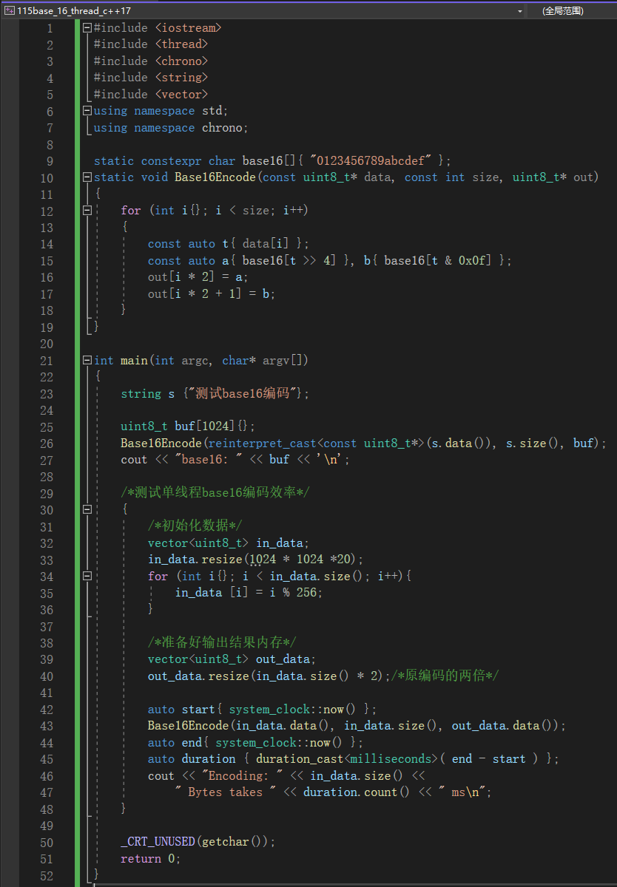
>
>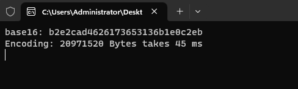

### 2. C++11实现base16多线程编码

>[手动实现base16编码(多线程)参考代码](https://github.com/WONGZEONJYU/stu_cpp_thread/blob/main/115base_16_thread_c%2B%2B11/115base_16_thread_c%2B%2B11.cpp)
>
>```c++
>static void Base16EncodeThread(const vector<uint8_t>& data,vector<uint8_t>& out)
>{
>	const auto size { data.size() };
>	/*系统支持的线程核心数*/
>	auto th_count{ thread::hardware_concurrency() };
>	/*对数据进行切片*/
>	auto slice_count (size / th_count);
>
>	if (size < th_count){ /*如果数据量太小,只切一片*/
>		th_count = 1;
>		slice_count = size;
>	}
>
>	/*准备好线程*/
>	vector<thread> ths;
>	ths.resize(th_count);
>    
>	auto d{ data.data() };
>	auto o{ out.data() };
>
>	for (int i {}; i  < th_count; i++){
>
>		const auto offset{ i * slice_count };
>		auto count{ slice_count };
>
>		/*处理最后一个线程*/
>		if ((th_count > 1) && ((th_count - 1) == i)){
>			count = slice_count + size % th_count;
>		}
>
>    	ths[i] = move(thread(Base16Encode,d + offset , count , o + static_cast<size_t>							(offset * 2)));
>	}
>
>	for (auto& th : ths){
>		th.join();
>	}
>}
>```
>
>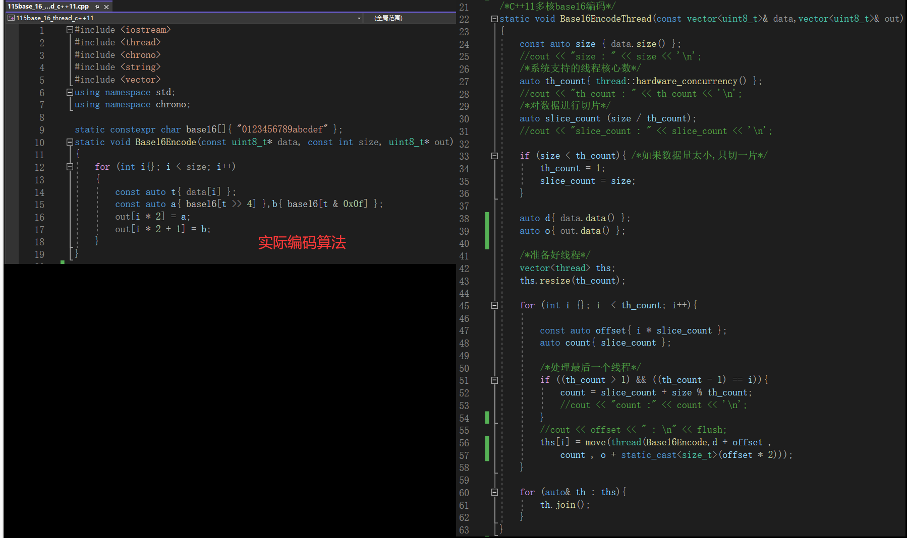
>
>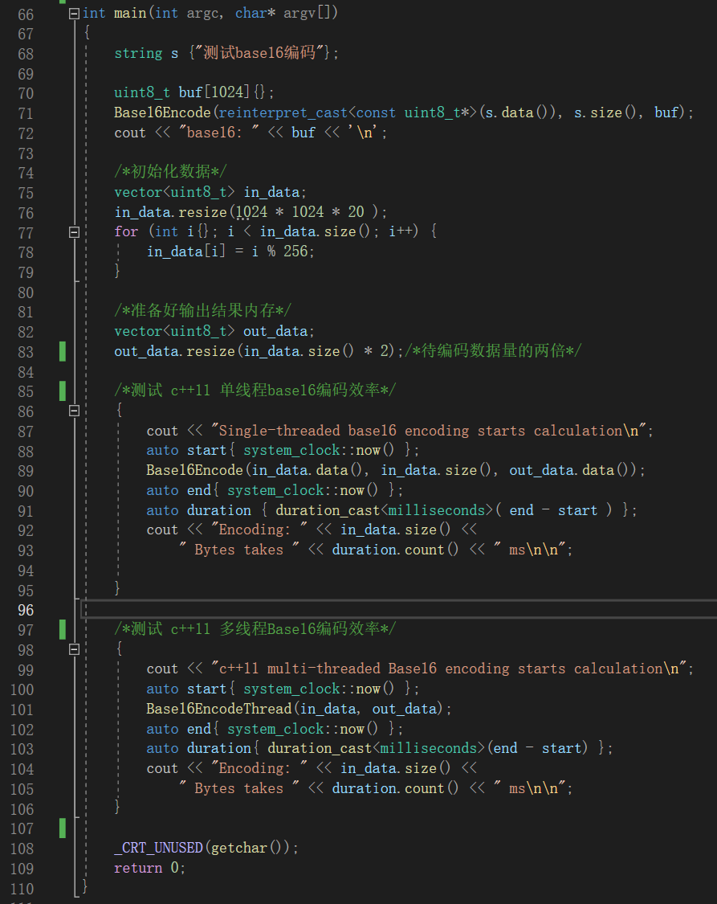
>
>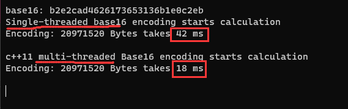

### 3. C++17实现base16多线程编码

>[C++17多线程base16编码参考代码](https://github.com/WONGZEONJYU/stu_cpp_thread/blob/main/116base_16_thread_c%2B%2B17/116base_16_thread_c%2B%2B17.cpp)
>
>- 工程的语言需设置成C++17
>
>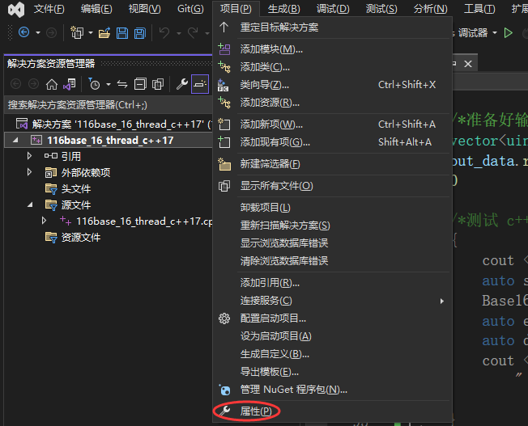
>
>- Debug版本
>
>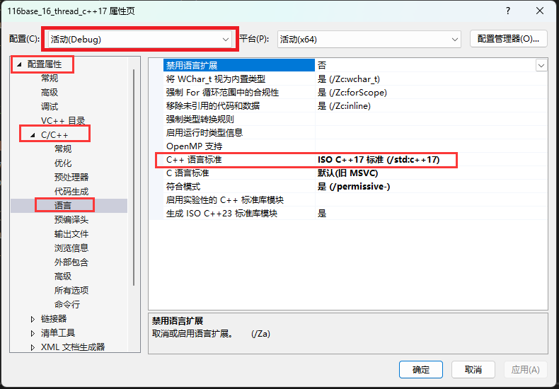
>
>- Release版本
>
>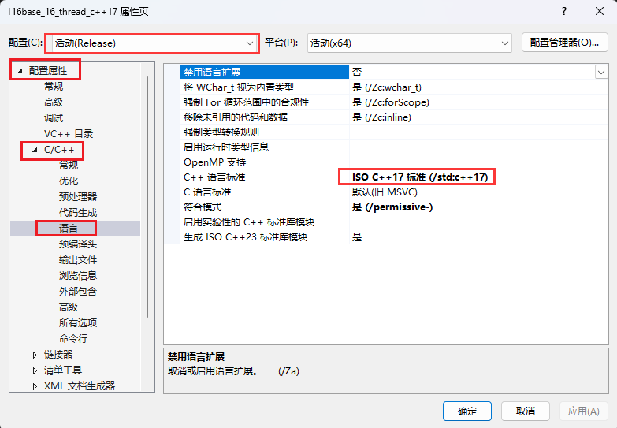
>
>- C++17的`std::execution::par`
>  - [关于std::execution::par参考链接](https://en.cppreference.com/w/cpp/algorithm/execution_policy_tag)
>
>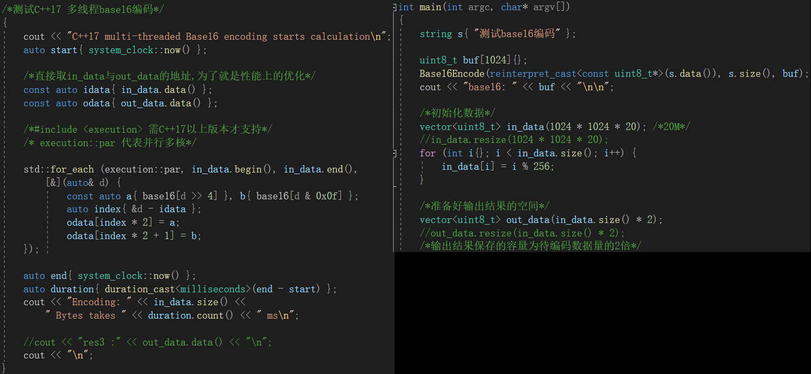

#### (1) Debug版本结果 : (数据量20M)

>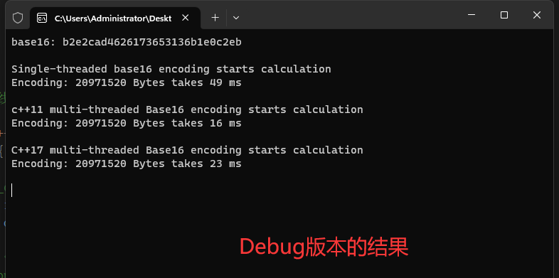

#### (2) Release版本结果 :  (数据量20M)

>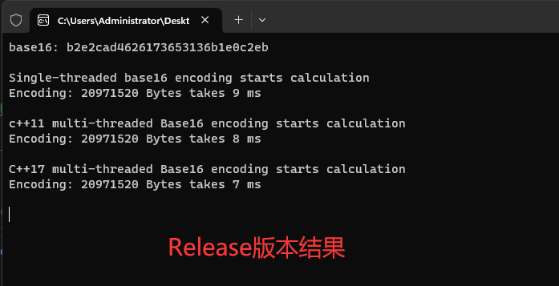

#### (3) Release版本结果 :  (数据量200M)

>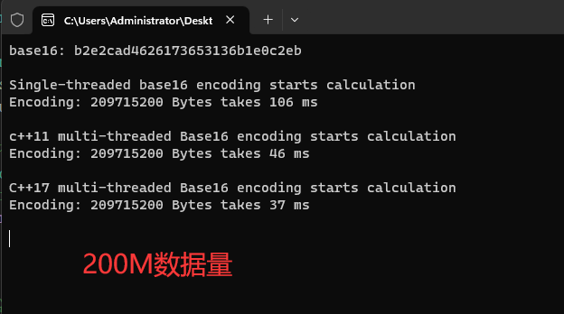

