# 五、基于线程池音频批量转码

## (一) FFMPEG 命令

>```
>Print help / information / capabilities:
>-L                  show license
>-h topic            show help
>-? topic            show help
>-help topic         show help
>--help topic        show help
>-version            show version
>-buildconf          show build configuration
>-formats            show available formats
>-muxers             show available muxers
>-demuxers           show available demuxers
>-devices            show available devices
>-codecs             show available codecs
>-decoders           show available decoders
>-encoders           show available encoders
>-bsfs               show available bit stream filters
>-protocols          show available protocols
>-filters            show available filters
>-pix_fmts           show available pixel formats
>-layouts            show standard channel layouts
>-sample_fmts        show available audio sample formats
>-colors             show available color names
>-sources device     list sources of the input device
>-sinks device       list sinks of the output device
>-hwaccels           show available HW acceleration methods
>
>Global options (affect whole program instead of just one file:
>-loglevel loglevel  set logging level
>-v loglevel         set logging level
>-report             generate a report
>-max_alloc bytes    set maximum size of a single allocated block
>-y                  overwrite output files
>-n                  never overwrite output files
>-ignore_unknown     Ignore unknown stream types
>-filter_threads     number of non-complex filter threads
>-filter_complex_threads  number of threads for -filter_complex
>-stats              print progress report during encoding
>-max_error_rate maximum error rate  ratio of errors (0.0: no errors, 1.0: 100% errors) above which ffmpeg returns an error instead of success.
>-bits_per_raw_sample number  set the number of bits per raw sample
>-vol volume         change audio volume (256=normal)
>
>Per-file main options:
>-f fmt              force format
>-c codec            codec name
>-codec codec        codec name
>-pre preset         preset name
>-map_metadata outfile[,metadata]:infile[,metadata]  set metadata information of outfile from infile
>-t duration         record or transcode "duration" seconds of audio/video
>-to time_stop       record or transcode stop time
>-fs limit_size      set the limit file size in bytes
>-ss time_off        set the start time offset
>-sseof time_off     set the start time offset relative to EOF
>-seek_timestamp     enable/disable seeking by timestamp with -ss
>-timestamp time     set the recording timestamp ('now' to set the current time)
>-metadata string=string  add metadata
>-program title=string:st=number...  add program with specified streams
>-target type        specify target file type ("vcd", "svcd", "dvd", "dv" or "dv50" with optional prefixes "pal-", "ntsc-" or "film-")
>-apad               audio pad
>-frames number      set the number of frames to output
>-filter filter_graph  set stream filtergraph
>-filter_script filename  read stream filtergraph description from a file
>-reinit_filter      reinit filtergraph on input parameter changes
>-discard            discard
>-disposition        disposition
>
>Video options:
>-vframes number     set the number of video frames to output
>-r rate             set frame rate (Hz value, fraction or abbreviation)
>-s size             set frame size (WxH or abbreviation)
>-aspect aspect      set aspect ratio (4:3, 16:9 or 1.3333, 1.7777)
>-bits_per_raw_sample number  set the number of bits per raw sample
>-vn                 disable video
>-vcodec codec       force video codec ('copy' to copy stream)
>-timecode hh:mm:ss[:;.]ff  set initial TimeCode value.
>-pass n             select the pass number (1 to 3)
>-vf filter_graph    set video filters
>-ab bitrate         audio bitrate (please use -b:a)
>-b bitrate          video bitrate (please use -b:v)
>-dn                 disable data
>
>Audio options:
>-aframes number     set the number of audio frames to output
>-aq quality         set audio quality (codec-specific)
>-ar rate            set audio sampling rate (in Hz)
>-ac channels        set number of audio channels
>-an                 disable audio
>-acodec codec       force audio codec ('copy' to copy stream)
>-vol volume         change audio volume (256=normal)
>-af filter_graph    set audio filters
>
>Subtitle options:
>-s size             set frame size (WxH or abbreviation)
>-sn                 disable subtitle
>-scodec codec       force subtitle codec ('copy' to copy stream)
>-stag fourcc/tag    force subtitle tag/fourcc
>-fix_sub_duration   fix subtitles duration
>-canvas_size size   set canvas size (WxH or abbreviation)
>-spre preset        set the subtitle options to the indicated preset
>```

## (二) FFMPEG命令行转码实验

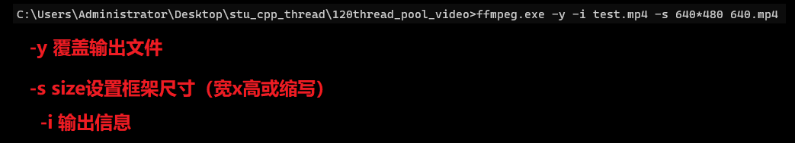 

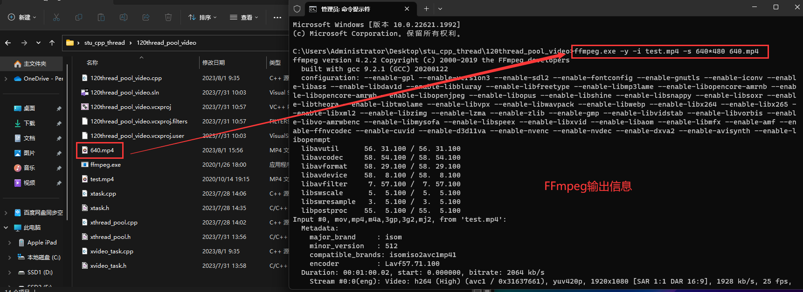 

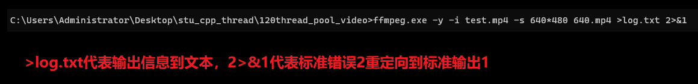 

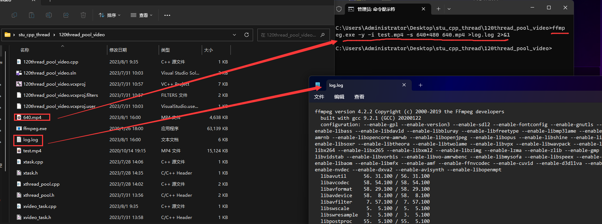 

## (三) 编码实验

### 1. 需求

* 命令行视频转码工具
* ffmpeg工具
* 用户输入 视频源 输出视频尺寸
* 在线程池中执行转码任务
* 转码任务调用ffmpeg

### 2.编码

[参考代码](/code/120thread_pool_video)

#### (1) 实验1 : 初步测试

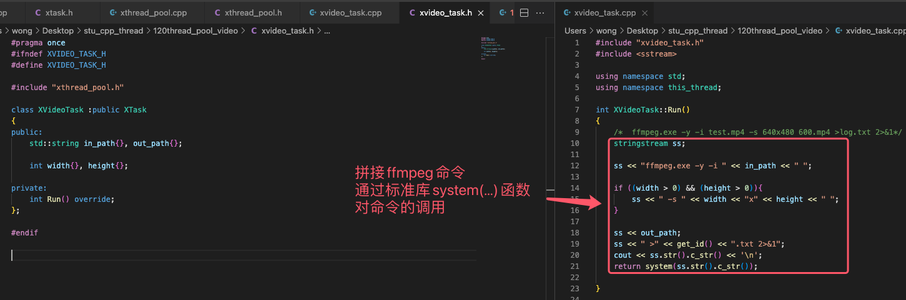 

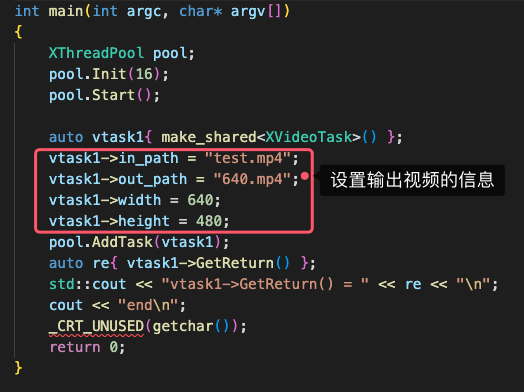 

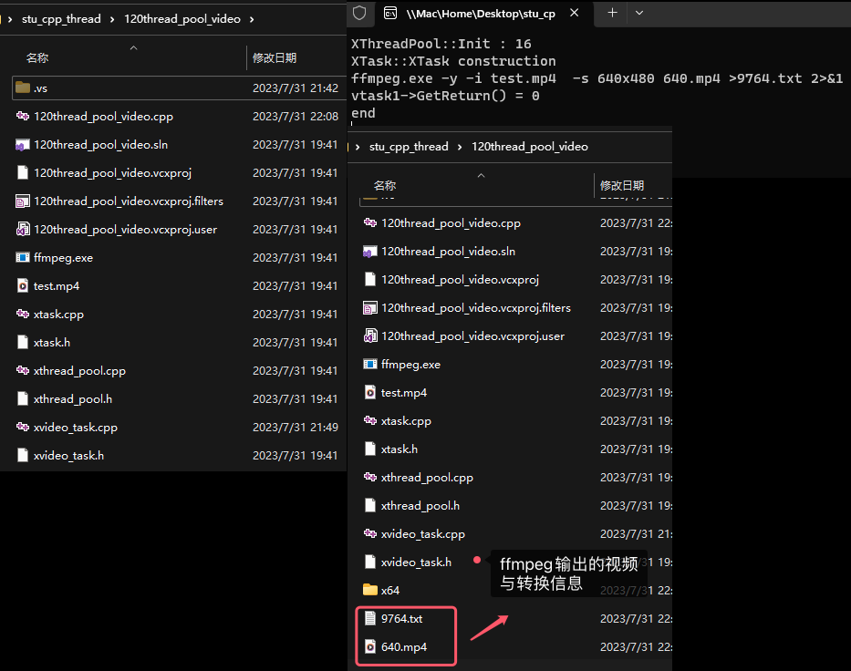 

#### (2) 实验2 : 完善

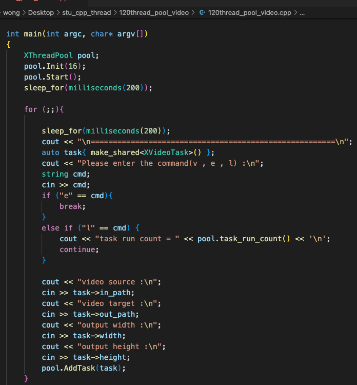 

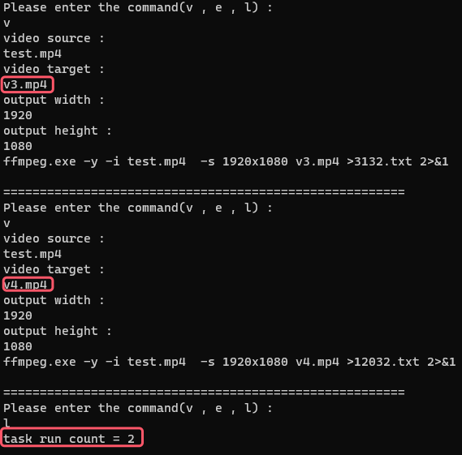 

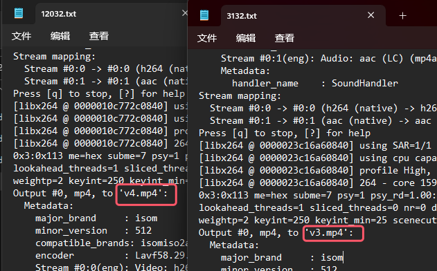 

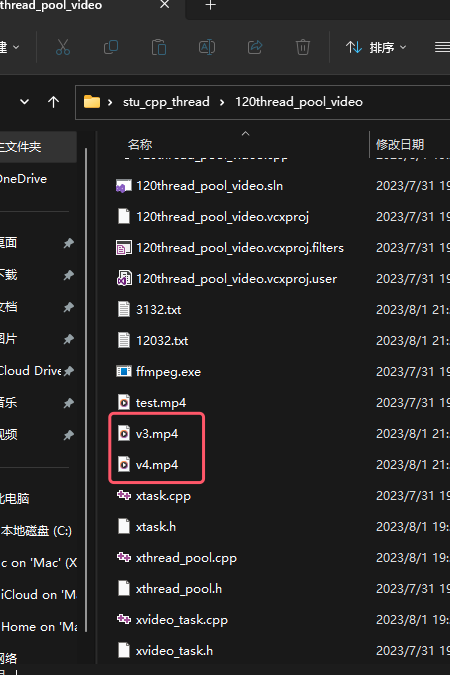 

>```
>本次代码截图只截取了主函数部分,其余部份请参考代码链接查看详细代码
>```
