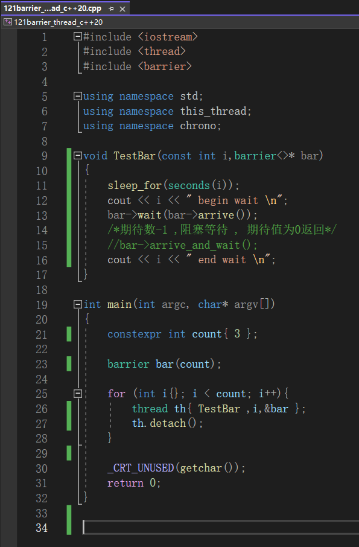
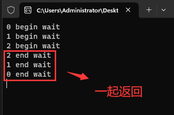

# 六、C++ 20线程特性

## (一) `std::barrier`屏障

* `arrive(...)`到达屏障并减少期待计数
* `wait(...)`在阶段同步点阻塞 , 直至运行其阶段完成步骤
* `arrive_and_wait(...)`到达屏障并把期待计数减少一 , 然后阻塞直至当前阶段完成
* `arrive_and_drop(...)`将后继阶段的初始期待计数和当前阶段的期待计数均减少一

>```c++
>void TestThread(int i, barrier<>* bar) throw()
>{
>  this_thread::sleep_for(chrono::seconds(i));
>  cout << i << " begin arrive wait" << endl;
>  bar‐>wait(bar‐>arrive());
>  cout << i<< " end arrive wait" << endl;
>}
>
>int main()
>{
>  constexpr int count {3};
>  barrier bar(count);
>  for (int i = 0; i < count; i++)
>  {
>    thread th(TestThread, i, &bar);
>    th.detach();
>  }
>  getchar();
>}
>```

## (二) 编程实验

[参考代码](https://github.com/WONGZEONJYU/stu_cpp_thread/blob/main/121barrier_thread_c%2B%2B20/121barrier_thread_c%2B%2B20.cpp)

 

 
