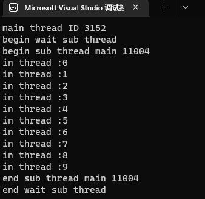

# 一、C++11多线程快速入门

## (一) 多线程概述

>❓为什么要用多线程？
>
>- 任务分解 : 耗时的操作 , 任务分解 , 实时响应
>- 数据分解 : 充分利用多核CPU处理数据
>- 数据流分解 : 读写分离 , 解耦合设计

## (二) 第一个多线程

>[101first_thread.cpp参考代码](https://github.com/WONGZEONJYU/stu_cpp_thread/blob/main/101first_thread.cpp)
>
>
>
>
>
>