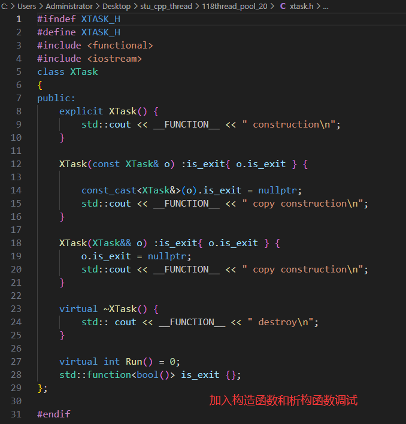

# 五、C++11 14 17 线程池实现

## (一) 线程池 v1.0 基础版本

### 1. 初始化线程池

>- 确定 **$\color{red}{线程数量}$** , 并做好 **$\color{red}{互斥访问}$**

### 2. 启动所有线程

>```c++
>std::vector<std::thread*> threads_;
>
>unique_lock<mutex> lock(mutex_);
>for (int i = 0; i < thread_num_; i++)
>{
>auto th = new thread(&XThreadPool::Run, this);
>threads_.push_back(th);
>}
>```

### 3. 准备好任务处理基类和插入任务

>- 线程分配的任务类
>
>```c++
>//线程分配的任务类
>class XTask
>{	public:
>	virtual int Run() = 0;// 执 行 具 体 的 任 务
>};
>
>std::list<XTask*> tasks_;
>```
>
>- 插入任务，通知线程池处理
>
>```
>unique_lock<mutex> lock(mutex_);
>tasks_.push_back(task);
>condition_.notify_one();
>```
>
>

### 4. 获取任务接口

>- 通过条件变量阻塞等待任务
>
>```C++
>///获取任务
>XTaskType XThreadPool::GetTask()
>{
>	unique_lock<mutex> lock(mutex_);
>	if (tasks_.empty()){
>		condition_.wait(lock);//阻塞 等待通知
>	} 
>    
>    if (is_exit_){
>        return nullptr;
>    }
>
>	if (tasks_.empty()){
>		return nullptr;
>	} 
>
>	auto task = tasks_.front();
>    tasks_.pop_front();
>	return task;
>}
>```

### 5. 执行任务线程入口函数

>```c++
>void XThreadPool::Run()
>{
>	while(!IsExit()){
>            auto task = GetTask();/*获取任务*/
>            if (!task){
>                continue;
>            }
>	
>            try{
>                task‐>Run();
>            } catch (...){
>                cerr << "XThreadPool::Run() exception" << endl;
>            }
>	}
>}
>```

### 6. 编码实验

>[线程池1.0参考代码](https://github.com/WONGZEONJYU/stu_cpp_thread/tree/main/117thread_pool_10)
>
>
>
>
>
>

## (二) 线程池 v2.0

>- 增加退出并等待任务处理结束,利用lambda表达式
>- 增加原子变量统计正在运行的任务的数量
>- 增加智能指针管理线程对象和任务对象的生命周期
>
>
>
>
>
>
>
>
>
>

